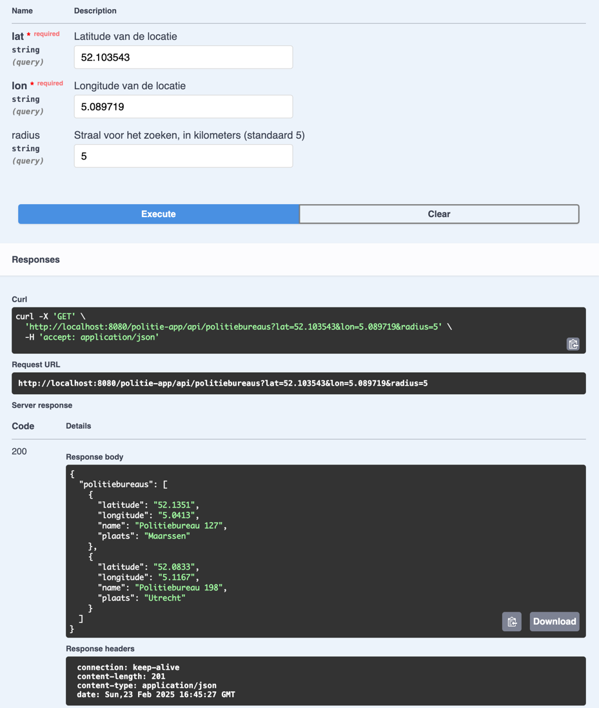
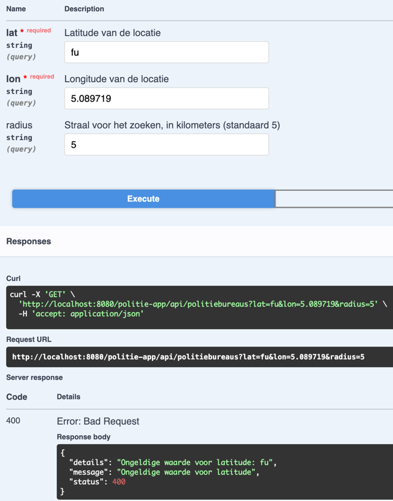
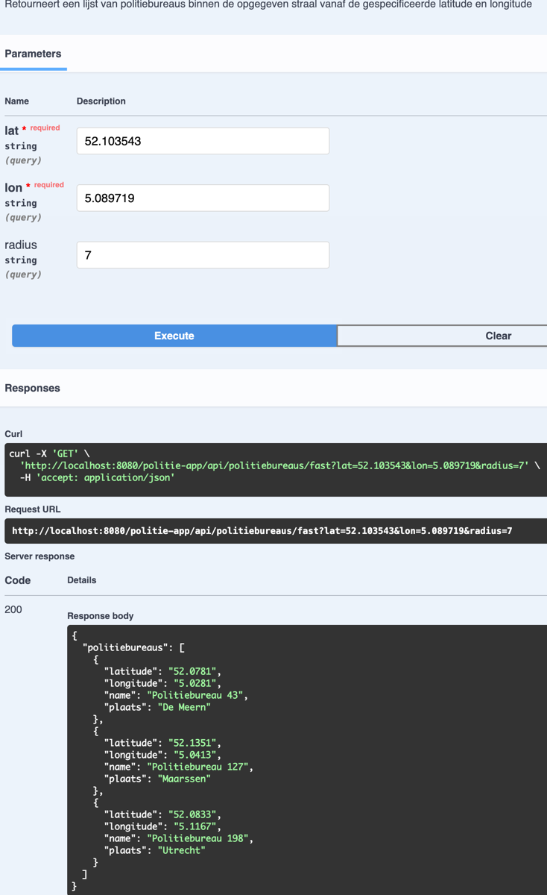

# Backend programmeeropdracht
Dit is de backend opdracht van Nick Stuivenberg. In deze readme staan de requirements en daaronder enkele screenshots 
die de werking van de applicatie aantonen. 

Ik heb een Spring Boot achtergrond. Ik heb me dan ook moeten inlezen met betrekking tot hoe klasse met een vaste functie
genoemd worden en waar ze horen te staan in de package-structuur. Dit zal in deze opdracht niet perfect zijn, maar ik 
maak me geen zorgen dat ik dat op de werkvloer gewoon goed ga doen. Is een kwestie van afkijken en nadoen.

# Requirements
* Java openjdk version "1.8.0_442"
* Wildfly 26.1.3 Final
* Zou niet uit moeten maken, maar gebouwd en getest op een Macbook M1 Max 32gb.
* Zorg dat je een war maakt met `mvn clean install` in de project root en draai deze in WildFly.

Om Swagger/OpenAPI te laten werken: Breng de volgende wijzingen aan in: 
`$WILDFLY_HOME/standalone/configuration/standalone.xml`

```xml
<extensions>
    <!-- Andere extensies -->
    <extension module="org.wildfly.extension.microprofile.openapi-smallrye"/>
</extensions>

```

```xml
<profile>
    <!-- Andere subsystemen -->
    <subsystem xmlns="urn:wildfly:microprofile-openapi-smallrye:1.0"/>
    <!-- Andere subsystemen -->
</profile>

```
Swagger is te bereiken op: http://localhost:8080/politie-app/swagger-ui/

# Werking applicatie
De applicatie bevat twee endpoints. Hieronder staat een korte uitleg. De uitgebreide uitleg is in 
`app/src/main/java/nl/politie/politiebureau/PolitiebureauResource.java` of op de Swagger pagina te vinden. 
* `http://localhost:8080/politie-app/api/politiebureaus/`
* `http://localhost:8080/politie-app/api/politiebureaus/fast`

## http://localhost:8080/politie-app/api/politiebureaus/
Retourneert een lijst van politiebureaus binnen de opgegeven straal vanaf de gespecificeerde latitude en longitude.

`http://localhost:8080/politie-app/api/politiebureaus?lat=52.103543&lon=5.089719&radius=5` geeft als resultaat twee
politiebureaus: 



Beide endpoints hebben foutafhandeling. Geef je bijvoorbeeld een coördinaat met een letter, dan wordt er een error 
gecommuniceerd.

`http://localhost:8080/politie-app/api/politiebureaus?lat=fu&lon=5.089719&radius=5`



Deze code is getest met JUnit 4 en Mockito. JavaEE heeft een niet zo'n makkelijk iets als `@SpringbootTest`. Hierdoor 
kon ik het endpoint niet volledig testen. Heb daardoor even gekeken naar Arquillian. Dat is nieuw voor mij en heb ik 
vanwege tijd en niet gevraagd niet geïmplementeerd. 

Hieronder een voorbeeld van een Unit test met Mockito:

```java
    @Before
    public void setUp() {
        List<PolitiebureauEntity> politiebureauEntities = Arrays.asList(
                new PolitiebureauEntity("Bureau 1", "Stad 1", 52.3786, 6.6272),
                new PolitiebureauEntity("Bureau 2", "Stad 2", 51.2786, 6.7272)
        );

        when(database.findAll()).thenReturn(politiebureauEntities);
        when(distanceCalculatorProducer.produceDistanceCalculator()).thenReturn(distanceCalculator);
    }

    @Test
    public void testFindBureausWithinRange() {
        double latitude = 52.0000;
        double longitude = 6.5000;
        double radius = 10.0;

        when(distanceCalculator.calculateDistance(anyDouble(), anyDouble(), anyDouble(), anyDouble()))
                .thenReturn(5.0)
                .thenReturn(15.0);

        List<PolitiebureauDTO> result = politiebureauService.findBureausWithinRange(latitude, longitude, radius);

        assertNotNull(result);
        assertEquals(1, result.size());
        assertEquals("Bureau 1", result.get(0).getName());
        assertEquals("Stad 1", result.get(0).getPlaats());
    }
```

De setUp-methode mockt de "database". In de test wordt vervolgens getest of de gemockte data uit de database correct 
wordt omgezet naar een collectie van PolitiebureauDTO's.

## http://localhost:8080/politie-app/api/politiebureaus/fast
Dit endpoint geeft een wat preciezer resultaat en is ook sneller dan het eerste endpoint (na de eerste aanvraag). Dit 
stukje code was voor mij om een beetje extra te puzzelen met JavaEE, dus jullie mogen het negeren.

Ik kwam tot deze oplossing, omdat ik continu door een lijst loopen niet heel erg efficiënt vond. Na wat googelen, kwam 
ik bij iets wat een Quadtree is, uit. Coordinaten worden dan gegroepeerd in kleinere cellen om zo sneller doorgezocht
te worden. De afstandsbepaling heb ik uiteindelijk met een Haversine formule gedaan. Deze is preciezer dan de formule
bij het eerste endpoint, maar wel wat langzamer. Dit wordt echter ruimschoots gecompenseerd door de Quadtree.

Er is nog een preciezere formule, maar voor het doel van de opdracht, wou ik het hier bij laten.

De endpoint is verder hetzelfde: `http://localhost:8080/politie-app/api/politiebureaus/fast?lat=52.103543&lon=5.089719&radius=7`



